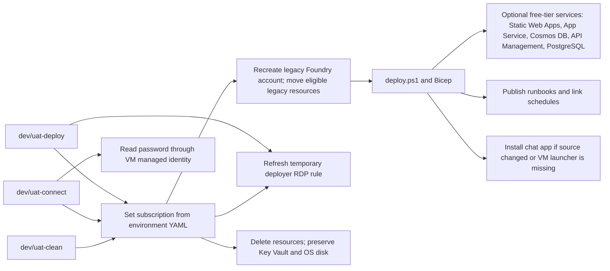

# Private Azure AI Foundry learning environment

This repository deploys a private Azure AI Foundry environment for learning,
prototyping, and development. It uses Bicep and PowerShell to create the
network, Azure OpenAI models, a current Microsoft Foundry account/project with Agent Service, Key Vault,
Storage, a free-tier-sized PostgreSQL Flexible Server, Azure Static Web Apps,
Azure Cosmos DB free tier, Azure API Management Consumption tier, an F1 Linux
App Service, monitoring, managed identities, and an optional Windows jumpbox
with a terminal chat app.

The deployment is secure by default:

- Service public network access is disabled.
- Private endpoints and private DNS provide service connectivity.
- Foundry Agent Service uses a dedicated delegated subnet plus tenant-owned Storage, Cosmos DB, and Azure AI Search.
- When a failed Foundry creation leaves the Agent subnet linked, `agentRecoverySubnetAddressPrefix` in environment YAML selects a new delegated subnet without deleting the original.
- Entra ID and resource-scoped RBAC are used instead of service keys.
- Cosmos DB uses a private endpoint, disabled local key authentication, and managed-identity SQL RBAC.
- Static Web Apps is deployed on the Free plan as a public static-hosting surface; do not put secrets or private data in static content.
- API Management is deployed on the Consumption tier as a public API gateway surface; keep usage within the included monthly call allowance when targeting $0.
- App Service is deployed on the F1 Free Linux plan as a public application surface; it does not support private endpoints or VNet integration.
- The jumpbox uses Trusted Launch and RDP is restricted to the deployer IP.
- Image-based jumpboxes use Azure Disk Encryption; migrated attached OS disks retain their existing encryption state.
- Automation permissions are limited to the individual VM and NSG used by its scheduled runbooks.
- Local configuration and credentials are git-ignored.

This project is released under the [MIT License](LICENSE).

## Before you start

Install:

- [Git](https://git-scm.com/download/win)
- [Azure CLI 2.60 or later](https://learn.microsoft.com/cli/azure/install-azure-cli)
- [PowerShell 7 or later](https://learn.microsoft.com/powershell/scripting/install/installing-powershell-on-windows)

The deploying identity needs **Owner**, or **Contributor** plus
**User Access Administrator**, at subscription scope. The deployment creates
resources and role assignments.

```powershell
git --version
az --version
$PSVersionTable.PSVersion
az login
```

## Root commands

Use `main.ps1` from the repository root for the common environment actions:

| Command | Behavior |
|---|---|
| `./main.ps1 dev-connect` | Refreshes `allow-rdp-user` and temporary `allow-rdp-deployer`, then securely reads the dev VM password from private Key Vault through the VM. Does not deploy. |
| `./main.ps1 dev-deploy` | Runs the dev deployment. |
| `./main.ps1 dev-clean` | Deletes dev resources except Key Vault and the VM OS disk; prompts unless `-Force` is supplied. |
| `./main.ps1 uat-connect` | Refreshes `allow-rdp-user` and temporary `allow-rdp-deployer`, then securely reads the UAT VM password from private Key Vault through the VM. Does not deploy. |
| `./main.ps1 uat-deploy` | Runs the UAT deployment. |
| `./main.ps1 uat-clean` | Deletes UAT resources except Key Vault and the VM OS disk; prompts unless `-Force` is supplied. |



## Deploy locally

1. Clone the repository and open PowerShell in its root folder.
2. Create local configuration from the tracked examples:

   ```powershell
   Copy-Item variables\core.yaml.example variables\core.yaml
   Copy-Item variables\dev.yaml.example variables\dev.yaml
   ```

3. Edit `variables\core.yaml` and `variables\dev.yaml`. At minimum, set
   `subscriptionId`, a short `baseName`, and an Entra object ID in `admin`. Add one stable RDP
   source address to `rdpAllowedPublicIpAddress`, or several addresses/ranges
   to `rdpAllowedIpCidrs`; deployment also includes your detected public IP for
   the VM allow rule. Keep these files local; they are intentionally ignored by
   Git.
4. Preview the deployment:

   ```powershell
   .\main.ps1 dev-deploy -WhatIf
   ```

5. Deploy:

   ```powershell
   .\main.ps1 dev-deploy
   ```

The same commands work for `uat` after creating `variables\uat.yaml` from its
example. A normal rerun exits without changes when the environment already
matches the desired state. VM passwords are preserved when possible; use
`-RotateVmPassword` only when an intentional rotation is required. Local
credential output is written only under the ignored `.local\` folder.
When `vmExistingOsDiskId` is configured for a migration, deployed-resource
validation verifies that attached disk and its configured SKU instead of an image reference or a new Azure Disk Encryption extension.

## Use the environment

When the jumpbox is enabled, connect with RDP from the approved source IP.
To update an already-deployed NSG after your public IP changes, preview and run:

```powershell
.\main.ps1 dev-connect -WhatIf
.\main.ps1 dev-connect
```

The `AI Chat` desktop shortcut starts the managed-identity Python chat app.
If first-run setup did not start, run:

```text
C:\ChatApp\first-run.ps1
```

For app commands, personas, connectivity tests, and troubleshooting, see
[app/README.md](app/README.md).

## CI/CD options

The repository includes both GitHub Actions and Azure DevOps pipelines:

- [GitHub Actions](.github/workflows/README.md)
- [Azure DevOps pipelines](pipelines/README.md)

Both workflows use OIDC where supported and keep configuration in protected
pipeline or repository secrets. Never commit `variables/*.yaml`, passwords,
tokens, generated credentials, or deployment state.

## Validation

Run the local checks before opening a pull request:

```powershell
.\scripts\test.ps1 -Mode Static
.\scripts\scan.ps1
git diff --check
```

For a deployed environment, use the applicable `Validate`, `Smoke`, and
`ChatDual` modes described in [scripts/README.md](scripts/README.md).
Cleanup is destructive but preserves the environment Key Vault and VM OS disk.
Preview it first and run it only with explicit authorization:

```powershell
.\main.ps1 dev-clean -WhatIf
```

## Where to find more detail

- [Architecture documentation](docs/README.md)
- [Azure Static Web Apps](docs/static-web-apps.md)
- [Azure Cosmos DB](docs/cosmos-db.md)
- [Azure API Management](docs/api-management.md)
- [Azure App Service](docs/app-service.md)
- [Bicep infrastructure](bicep/README.md)
- [PowerShell automation](scripts/README.md)
- [Environment configuration](variables/README.md)
- [Application](app/README.md)
- [Repository map](index.md)
- [Contributor and coding-agent guidance](AGENTS.md)

Machine-specific deployment state, generated credentials, and local notes are
intentionally excluded from source control.
